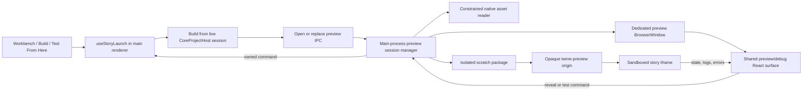

# Desktop preview and debug parity

Status: completed
Owner: frontend, Electron, and preview-runtime maintainers
Last verified: 2026-07-27
Source of truth: shipped managed desktop Play, Test, and Proof behavior
Parent roadmap: [Product depth and legacy retirement](../../roadmap/product.md)

Completion record: all unit, Electron-main, protocol, browser, and packaged
acceptance gates passed on 2026-07-27. The packaged matrix covers managed
Play/debug/replacement commands, Test From Here and Paperthin Proof, copied
asset and storage isolation, cleanup and protocol lifetime, and current-passage
identity across bundled Chapbook, Harlowe, Snowman, and SugarCube.

## Outcome

Desktop Play, Test, and Proof open in an app-owned preview window with the same
debug experience as browser previews:

- build target, story, start passage, build health, and viewport controls;
- best-effort current-passage reporting;
- captured console logs, runtime errors, and unhandled rejections;
- reload, Source, Graph, Test From Start, and Test Current actions; and
- Test From Here launches from every existing authoring surface without changing
  the story's saved start passage.

The desktop preview must still use the bounded scratch-package pipeline so
relative project assets work. It must build from the current renderer-owned
project session, not from a second copy of persisted state.

## Starting state

- `useStoryLaunch()` has two launch architectures. Browser calls open the
  `/play`, `/test`, and `/proof` routes. Electron builds HTML in the main
  renderer, safely copies requested project assets to an isolated scratch
  directory, then opens `index.html` in the system browser.
- `StoryPreviewFrame` and `story-preview-debug` already provide the browser
  debug strip, preview instrumentation, current-passage heuristics, console and
  runtime-error capture, source/graph reveal, Test Current, reload, and viewport
  presets.
- Electron has a storage-capable `twine-preview://` protocol for in-memory HTML,
  and `StoryPreviewFrame` uses it when a preview route happens to run in
  Electron. It does not serve a complete scratch package, and the normal
  desktop launch path does not use the route or protocol.
- The scratch pipeline already enforces opaque per-preview directories,
  project-capability checks, no-follow native asset reads, path containment,
  byte and count ceilings, serialized creation, and shutdown cleanup.
- The hardened scratch path always copies main-owned bytes. The exposed
  link/copy asset-strategy preference is a legacy no-op and must not be treated
  as an available implementation strategy.
- Existing application IPC is guarded by `trustedIpcRegistrar`, which admits
  only the top-level packaged `renderer/index.html`. A preview entry needs its
  own narrower sender gate; broadening the application gate would expose the
  general project bridge to the preview.
- Test From Here already reaches `testStory(storyId, passageId)` from Text,
  Graph, Split, Contents, Diagnostics, search results, and asset usage surfaces.
  Electron honors the passage ID during publishing, but the resulting
  system-browser page has no app-owned debug or command bridge.

## Scope

### Included

- Play, Test, Proof, and passage-specific Test launches in packaged Electron.
- A dedicated lightweight Electron preview renderer that does not initialize a
  story store, project host, watcher, or persistence stack.
- Reuse of the browser preview UI and runtime instrumentation.
- Safe scratch-package asset serving through an opaque preview origin.
- Bidirectional commands between a preview window and the main editor window.
- Multiple simultaneous preview windows with independent story state, storage,
  logs, assets, and lifecycle.
- Focused unit, integration, and packaged-Electron coverage.
- User, architecture, roadmap, and current-status documentation updates.

### Not included

- Variable inspection, visited-passage history, format-specific devtools, source
  maps, or runtime-to-source span mapping.
- Replacing the current best-effort passage detector with format-specific
  adapters.
- Browser binary-asset persistence or browser/desktop asset-model convergence.
- A general-purpose arbitrary-file protocol.
- A setting to keep opening desktop previews in the system browser.

Those runtime-inspector features can layer on the shared surface after desktop
parity lands.

## Product contract

### Launch behavior

- Play, Test, Proof, and Test From Here open a separate app-owned preview
  window. Existing launch entry points retain their labels and busy/error
  feedback.
- Preview HTML is built once in the owning main renderer from its current core
  project session. The preview renderer never reloads the story from disk or
  constructs a second project authority.
- Passage references and the launch passage are derived from the same
  materialized story snapshot that produced the HTML, so published local IDs
  cannot drift from the command metadata.
- Test From Here publishes with `buildTarget: "test"`,
  `formatOptions: "debug"`, and `startMode: "afterStartup"`. It does not mutate
  `story.startPassage`.
- Test From Start relaunches from that preview session's launch passage. Test
  Current is enabled only when runtime observation resolves to a known passage
  ID.
- Test From Start and Test Current rebuild from the editor's latest live state
  and replace the content in the same preview window. They do not silently
  replay stale HTML. Each committed generation records its own launch passage;
  a Test Current replacement makes the selected current passage the launch
  passage for that generation and for its subsequent Test From Start action.

### Runtime behavior

- Browser and desktop use the same debug-strip and runtime-state components.
  Platform code differs only in how preview content is hosted and how commands
  reach the editor.
- The desktop shell applies the owning editor's computed light/dark theme,
  high-contrast preference, and reduced-motion preference without loading a
  preferences store. Later appearance changes are sent as presentation-only
  events and do not rebuild the story.
- Console `log`, `info`, `warn`, and `error`, `window.error`, and
  `unhandledrejection` events appear with the same ordering, cap, tone, and reset
  behavior in both platforms.
- Current-passage detection and ID resolution use the same injected bridge and
  passage reference list in both platforms.
- Reload reloads only the current staged package. It clears observed runtime
  state and logs but does not rebuild the story.
- Source and Graph focus the owning editor window and navigate to the observed
  passage when one is known, otherwise to the preview's launch passage.
- A rebuild failure leaves the existing preview visible and shows an actionable
  error in the preview shell.
- Destroying, reloading, or crashing the owning editor renderer closes and
  releases all of its previews. A crashed or destroyed preview renderer
  releases its own session without affecting other previews.

### Asset and storage behavior

- The main process continues to authorize requested asset paths against the
  active project capability and to read bytes through the constrained native
  reader.
- Each staged generation gets an unguessable
  `twine-preview://<package-token>/` origin backed only by its `index.html` and
  exact normalized asset allowlist. Relative and root-relative project assets
  resolve beneath that origin; query strings do not change allowlist identity.
- Separate package tokens are separate storage origins. Reload keeps the
  current token and storage origin; a successful Test From Start or Test
  Current replacement commits a fresh token. Previews cannot read another
  preview's files or browser storage.
- The scheme handler is registered once for the application lifetime. Closing a
  preview releases its session/package-registry entries and scratch directory,
  not the global protocol handler. Failed launch and replacement paths clean
  partial or superseded generations. Shutdown cleanup remains a final safety
  net.

## Architecture



### Ownership boundaries

- The main renderer owns live story materialization, build options, proofing
  format selection, snapshot-matched passage metadata, story summaries, and
  command execution.
- Electron main allocates session IDs, package tokens, and replacement
  generations. It owns preview-window identity, project capabilities, native
  asset reads, scratch-package lifecycle, the application-lifetime scheme
  handler, the per-generation package registry, command routing, and window
  focus.
- The preview renderer owns only presentation and ephemeral runtime state. It
  receives a size-checked serializable descriptor and an opaque preview URL.
- The story iframe owns story-format runtime execution. Its only app-facing
  channel is the existing session-tokened `postMessage` bridge.
- Rust/Core remains authoritative for story documents, summaries, diagnostics,
  graph data, and asset inventory. No preview-only index or persisted mutation
  path is added.

## Proposed contracts

Add a serializable desktop preview descriptor to the Electron shared types. The
exact naming can follow nearby conventions, but it should carry only bounded UI
metadata:

```ts
interface NativeStoryPreviewDescriptor {
	sessionId: string;
	generation: number;
	storyId: string;
	storyName: string;
	target: 'play' | 'test' | 'proof';
	bridgeSessionId: string;
	appearance: {
		theme: 'dark' | 'light';
		highContrast: boolean;
		reducedMotion: boolean;
	};
	launchPassage?: {id: string; name: string};
	passages: Array<{id: string; localId: string; name: string}>;
	summary?: CoreStorySummary;
	htmlBytes: number;
	storyDataCount: number;
}
```

`sessionId` and `generation` are main-process output, not renderer-selected
identity. `bridgeSessionId` is fresh for each built generation. `htmlBytes`
describes the published HTML before instrumentation, matching the browser
badge. Passage references are derived from the materialized build snapshot and
retain published local-ID order.

The renderer-facing launch call additionally carries HTML, the known project
root when one exists, and the existing bounded logical asset requests. As the
current preload does, it substitutes the opaque capability already granted for
that root before IPC reaches main; main never accepts a renderer-supplied
filesystem path as project authority. The preview renderer must not receive a
project root, capability, scratch path, asset bytes, or general filesystem
method.

Enforce explicit aggregate byte and list-count limits on the launch metadata,
descriptor, passage references, command payloads, and runtime log messages.
Reject malformed structured-clone values instead of relying on TypeScript
types. Limits must admit the supported 50k benchmark project and the repository
import passage ceiling without making the manager an unbounded object registry.
Test From Start carries no preview-selected passage; main attaches the current
generation's recorded launch passage. Reveal and Test Current passage IDs must
exist in the stored generation descriptor before the command is routed, then
the owning renderer revalidates them against its latest live story.
Preview-side API calls do not accept an arbitrary session ID: main derives the
session from `event.sender`. Ready, command, result, frame-load, and replacement
messages carry a generation, and main rejects stale generations.

Use a dedicated preview preload with a narrow API:

- read the descriptor and opaque content URL for the calling preview window;
- subscribe to generation replacement and command-result events;
- subscribe to bounded presentation-only appearance changes;
- send Source, Graph, Test From Start, and Test Current commands; and
- notify main when the preview renderer is ready.

Keep application and preview IPC gates separate:

- application launch/replace handlers retain the existing exact
  `renderer/index.html` top-frame gate, then verify that the sender owns the
  session;
- preview handlers admit only the exact packaged preview entry and then verify
  that the sender web contents matches the managed session; and
- no preview channel is added to `trustedIpcRegistrar`, because doing so would
  make every general application handler callable by the preview entry.

The preview preload exposes no raw `ipcRenderer`, and the general project bridge
is never installed in the preview window.

## Implementation phases

### Phase 1 — Separate the shared preview contract

- Split platform-neutral bridge DTOs, HTML instrumentation, passage resolution,
  bounded message normalization, and runtime-state/log reducers out of the
  route-owned module. Keep React badge mapping and route concerns separate.
- Extract the DOM appearance application used by `ThemeSetter` so the preview
  shell can apply the same `data-app-theme`, high-contrast, reduced-motion, and
  `color-scheme` contract from plain descriptor values.
- Refactor `StoryPreviewFrame` into a shared preview/debug surface plus a content
  host. Support the existing browser `srcDoc` source and an opaque desktop URL
  source without duplicating runtime state or controls. The shared surface must
  not discover or call the general Electron bridge itself.
- Keep browser Play, Test, and Proof behavior unchanged while adding parity
  tests around the shared surface.
- Define the serializable desktop launch descriptor, command union, and
  generation-tagged replacement/error result types in Electron shared types.

Exit: browser preview tests pass through the new shared surface, and no Electron
behavior has changed.

### Phase 2 — Turn scratch output into managed preview sessions

- Refactor scratch creation so it can return an owned staged-package handle
  instead of immediately calling `shell.openPath()`. Keep the current
  `openWithScratch*` functions as thin stage-and-open compatibility adapters
  until Phase 6 so intermediate phases do not break desktop launches.
- Replace the in-memory HTML map with a package registry behind the existing
  application-lifetime scheme handler. Register one opaque token against one
  exact staged package; never install one protocol handler per preview. Keep
  `registerStoryPreview`/`releaseStoryPreview` as temporary HTML-only adapters
  for Electron preview routes until Phase 6.
- Preserve the scheme's standard, secure, storage-capable privileges and keep
  service workers disabled.
- Serve only `GET` and `HEAD` for `index.html` and normalized allowlisted asset
  output paths. Require the exact scheme, fixed-format token host, and no
  username, password, or port. Ignore query strings for allowlist lookup, decode
  a path exactly once, accept ordinary escapes such as `%20`, and reject encoded
  separators, NULs, traversal, schemes, absolute paths, directories, assets
  colliding with the reserved `index.html`, and unknown tokens.
- Return correct media types, `Content-Length`, `X-Content-Type-Options` set to
  `nosniff`, `Accept-Ranges`, `no-store`, and 404/405 responses as appropriate.
  Support one validated byte range with `206`/`Content-Range`, and `416` for an
  invalid range, so staged audio and video work and seek reliably.
- Preserve the existing payload, path, capability, queue, and aggregate session
  limits, plus an explicit live-window/package count. Reaching a limit rejects
  the new launch with an actionable error; it must never silently evict a
  package still owned by an open preview, as the current 64-entry HTML map can.
- Add idempotent stage, commit, and release operations. A replacement keeps the
  old generation registered until the preview confirms the new frame loaded;
  rollback releases the candidate, while commit releases the superseded
  package before removing its directory. Tolerate already-closed windows during
  shutdown.

Exit: protocol tests prove HTML and asset loading, query/escaped-path behavior,
range responses, per-token isolation, traversal rejection, live and byte
limits, rollback/commit cleanup, and release cleanup without opening a window.

### Phase 3 — Add the dedicated desktop preview window

- Add an explicit multi-page preview HTML/React entry to the Vite build and
  packaged renderer output. It imports the design system and shared preview
  surface but not `App`, `StateLoader`, `CoreProjectHostProvider`, project sync,
  persistence, or PWA registration. Give the shell a restrictive content
  security policy that permits its packaged resources and the
  `twine-preview:` frame, not arbitrary remote script.
- Apply descriptor appearance fields directly to the shell document and route
  later appearance-only owner updates without instantiating `PrefsContext`.
- Add a dedicated preview preload exposing only the narrow preview API, and a
  preview-only IPC registrar that exact-matches the packaged preview entry.
- Add a main-process preview-window/session manager. Create BrowserWindows with
  context isolation, renderer sandboxing, no Node integration in any frame,
  `webSecurity`, the dedicated preload, and a deny-all permission posture for
  the preview shell and embedded story. Keep previews in the default Electron
  session so the application-lifetime protocol handler is available, install
  the session-wide permission policy only once, and retain its rule that only
  the trusted main frame can request the one supported permission.
- Apply explicit main-frame, subframe-navigation, popup, and download policy.
  The shell may load only the packaged preview entry; the direct app-owned story
  frame may navigate only within its current package origin; validated external
  HTTPS links follow the configured system/block link policy; and
  user-initiated story downloads use the normal save flow without being
  auto-opened. Distinguish the direct story frame from story-created descendant
  frames so the guard does not accidentally break web embeds that work in the
  browser preview.
- Support multiple independent preview windows and an in-place content
  replacement message for Test From Start/Test Current.
- Close and release owned sessions on normal window close, renderer
  destruction/crash, owner reload/destruction, and application shutdown.

Exit: focused manager tests open, replace, crash, and close two isolated preview
windows, prove the preview entry cannot call a general application IPC handler,
and show that no second application store initializes.

### Phase 4 — Route Play, Test, and Proof through the window manager

- Consolidate Electron launch preparation in `useStoryLaunch()` so every target
  refreshes native asset inventory, materializes and builds once, queries the
  bounded story summary, derives published passage references and the launch
  passage from that same materialized snapshot, instruments HTML with a fresh
  bridge session ID, and sends one preview request. Do not combine an older
  HTML build with passage ordering from a later React render.
- Implement this as a publishing helper that returns the package plus
  snapshot-derived preview metadata from one materialization. Do not
  materialize once for metadata and then call the current package helper, which
  would materialize and build again.
- Preserve target-specific options:
  - Play: `buildTarget: "play"`.
  - Test: `buildTarget: "test"` and `formatOptions: "debug"`.
  - Test From Here: additionally `startId` and
    `startMode: "afterStartup"`.
  - Proof: the selected proofing format and proof package.
- Keep the browser launch branch opening the existing routes.
- Preserve caller-facing promise semantics so the workbench, command palette,
  Build screen, and passage actions continue to show launch failures. Resolve a
  launch only after staging and preview-shell readiness; reject creation,
  loading, and ownership failures.

Exit: desktop Play, Test, Proof, and every existing Test From Here caller open
the managed window with the correct descriptor and build options.

### Phase 5 — Close the preview-to-editor command loop

- Mount one command controller in the main application renderer. It receives
  only commands routed from sessions owned by that renderer and broadcasts
  bounded appearance changes to those sessions.
- For Source and Graph, focus the owning main window and navigate to the story
  plus resolved passage query. Revalidate that the passage belongs to the
  session's story before navigating.
- For Test From Start and Test Current, rebuild a fresh Test package in the main
  renderer and atomically replace the requesting preview session. Start uses
  the current generation's recorded launch-passage UUID; Current uses the
  observed resolved passage after revalidating it against the latest story.
  Commit updates the descriptor target, metrics, passage map, and launch passage
  along with the content URL.
- Both commands use `buildTarget: "test"`, `formatOptions: "debug"`, the chosen
  `startId`, and `startMode: "afterStartup"`; neither mutates the saved start
  passage.
- Replacements reuse the Phase 4 preparation helper, including native asset
  refresh, one live-session materialization/build, a current summary, bounded
  asset requests, and a fresh bridge session ID.
- Return busy, success, and error results to the requesting preview. Disable
  duplicate test commands while a replacement is pending and discard stale
  completions by generation.
- Stage replacements under a new token, switch the iframe, and commit only
  after a generation-matched load acknowledgement. A timeout, load error,
  preview close, owner close, or stale completion rolls back the candidate and
  leaves the old preview usable.
- If the story or passage no longer exists, keep the current preview open and
  report that exact condition.

Exit: desktop Source, Graph, Test From Start, and Test Current work without
granting the preview renderer project-store or filesystem access.

### Phase 6 — Retire the raw system-browser launch path

- Remove `openWithScratchFile`, `openWithScratchPackage`,
  `registerStoryPreview`, `releaseStoryPreview`, their general-preload methods,
  and the obsolete IPC handlers once all callers use managed sessions.
- Keep the reusable scratch staging and cleanup code behind the new session
  manager.
- Remove the inert preview link/copy control and shared platform setting. Keep
  the legacy `--scratchAssetStrategy` parser only as an explicitly deprecated,
  ignored compatibility option if command-line compatibility still requires
  it; no documentation may claim that preview directories contain links.
- Update Testing, Playing, Proofing, Assets, Settings, command-line, and Scratch
  Folder documentation to describe the app-owned window, debug controls, opaque
  scratch origin, copied-asset behavior, multiple windows, and cleanup
  lifetime.
- Update the product roadmap and current status when the observable behavior
  ships, and record the new preview entry/IPC/session boundaries in architecture
  documentation. Move this plan to `docs/archive/completed-plans/` only after
  the full acceptance matrix passes.

Exit: no production Play/Test/Proof caller invokes `shell.openPath()`, and no
preview window receives the general Electron project bridge.

## Verification matrix

### Unit and component

- Browser `srcDoc` and desktop URL sources feed the same runtime-state reducer.
- The preview shell applies theme, high-contrast, and reduced-motion state from
  its descriptor and later appearance-only updates.
- Spoofed source windows, wrong bridge session IDs, and malformed messages are
  ignored; oversized log/state payloads are truncated or rejected at the shared
  contract boundary.
- `console.*`, `error`, and `unhandledrejection` produce ordered, capped,
  correctly toned log entries.
- Current passage resolves by stable ID, local story-format ID, and exact name;
  unknown passages do not enable Test Current.
- Passage references and launch metadata retain the exact real-passage
  order/IDs from the story snapshot used to publish. A passage-specific test's
  appended synthetic startup passage is not exposed as a stable passage and
  cannot enable Test Current before it redirects.
- Reload and successful content replacement reset logs/runtime state. Reload
  keeps the current package token; replacement uses a new token; a failed
  replacement preserves the current frame.
- Play, Test, Test From Here, and Proof produce the exact expected build
  options, selected proofing format, descriptor, and asset request list.

### Electron main process

- Only the owning main renderer can open or replace its preview session.
- Only the matching preview web contents can read a descriptor or send a
  command.
- The preview entry is rejected by every general application IPC handler, and
  subframes are rejected by both IPC registrars.
- One preview cannot obtain another session's descriptor or package token, or
  use IPC to replace or release another preview's package. The protocol offers
  no token enumeration.
- Scratch paths reject plain and percent-encoded traversal, schemes, absolute
  paths, duplicate normalized paths, and over-limit packages, while valid
  percent-encoded filenames and query strings resolve to the allowlisted asset.
- Protocol URLs with user info, a port, a malformed token host, or a
  non-preview scheme are rejected.
- `GET`, `HEAD`, valid and invalid byte ranges, media types, response hardening
  headers, and unsupported methods have explicit protocol tests.
- Reaching the live-session/package cap rejects the next launch without
  evicting or breaking an existing preview.
- Unknown and released protocol tokens return 404.
- Window creation failure, staging/registry failure, asset-read failure,
  replacement races, preview crash, owner reload/crash, normal close, and app
  shutdown all release resources.
- Navigation, popup, permission, preload, context-isolation, sandbox, and
  Node-integration policies have explicit tests, including proof that preview
  setup does not replace the main window's session-wide permission policy.

### Packaged Electron

- Play opens a second app window with the Play badge, story name, rendered
  passage, health metrics, viewport controls, and zero initial runtime errors.
- Test From Here on a non-start passage opens in debug mode at that passage and
  leaves the saved start passage unchanged after reload.
- Following a story link updates Current Passage. A console log, thrown runtime
  error, and rejected promise appear in the preview log UI.
- Test Current and Test From Start replace the same preview window with a fresh
  build containing an editor change made after the original launch.
- Source and Graph focus the main window and reveal the expected passage.
- Proof opens in the same shell with the selected proofing format.
- A file-backed project loads image, audio/video, stylesheet, and other copied
  relative assets from its opaque preview origin, including a percent-encoded
  filename, query-bearing URL, root-relative URL, and media range request.
- Two simultaneous previews with colliding `assets/...` names remain isolated.
- Reload preserves same-origin story storage, while Test Current replacement
  starts on a fresh generation origin.
- Closing both windows removes their live package-registry entries and scratch
  roots; the application-lifetime scheme handler remains installed.

### Regression gates

- `npm run test:unit`
- `npm run lint`
- `npm run format:check`
- `npm run build:web`
- `npm run build:electron-main`
- `npm run test:packaging`
- focused `npm run e2e:electron:packaged` preview coverage against a freshly
  built packaged app
- the existing browser Playwright preview smoke test through `npm run e2e`

## Risks and mitigations

- **Second application initialization:** loading the normal app route in every
  preview would duplicate stores, watchers, and project sessions. Use a
  dedicated renderer entry with no application providers.
- **Stale editor state:** making the preview window publish from disk would miss
  current edits. Build and rebuild only in the owning main renderer, and derive
  local passage IDs from the materialized build snapshot instead of a later
  React render.
- **Descriptor scale:** serializing an unchecked passage map can duplicate
  large-story metadata and block a renderer. Enforce aggregate descriptor
  limits that still cover the supported 50k fixture and import ceiling, and
  keep bodies, assets, and graph data out of the descriptor.
- **Privilege leakage:** using the general preload in a story-hosting window
  would unnecessarily expose project APIs. Use a dedicated preload and
  a separate exact-entry IPC registrar with sender/session ownership checks;
  never widen `trustedIpcRegistrar` to accept the preview entry.
- **Permission-policy clobbering:** Electron permission handlers are
  session-wide. Install the default-session policy once; its existing
  web-contents and exact-main-entry checks deny every preview caller. Do not
  install a per-preview handler that overwrites the main policy.
- **Asset traversal or cross-session reads:** never map URL paths directly to
  arbitrary disk paths. Register an exact normalized output-path allowlist for
  each opaque token and retain the native no-follow reader.
- **Incomplete protocol semantics:** naive full-body responses can break media
  seeking, while naive URL decoding can reject valid filenames or admit
  traversal. Define one-pass decoding, query handling, `HEAD`, and single-range
  behavior before routing asset requests.
- **Silent live-session eviction:** the current in-memory protocol map drops its
  oldest entry at 64 registrations. Managed previews reject new work at a
  configured live limit and never evict an entry owned by an open window.
- **Storage collisions:** do not reuse one preview origin. Give every window or
  replacement generation a fresh token and origin.
- **Replacement races:** attach a generation to rebuild requests and commit only
  the latest successful result. Release superseded staging after the preview
  acknowledges the new source.
- **Format variance:** current-passage detection is intentionally best effort.
  Keep the shared fallback order and add acceptance coverage for the bundled
  Chapbook, Harlowe, Snowman, and SugarCube formats without claiming a
  format-specific debugger contract.
- **Story-controlled navigation:** keep story content in a cross-origin
  sandboxed iframe, deny shell navigation, and route only validated external
  URLs through the existing link policy.

## Completion criteria

This plan is complete only when:

- desktop Play, Test, Proof, Test From Here, Test Current, and Test From Start
  pass the packaged acceptance matrix;
- desktop and browser render the same preview/debug component contract;
- live relative project assets work without exposing a filesystem primitive;
- no preview creates a second project host/session or reads stale persisted
  story state;
- multiple previews and replacement generations are isolated and fully cleaned
  up across close, crash, reload, and shutdown;
- the dedicated preview entry cannot invoke any general application IPC;
- the system-browser scratch launch path, broad preview IPC, and inert
  link/copy preview control are removed; and
- roadmap, status, architecture, and user documentation reflect the shipped
  behavior.
