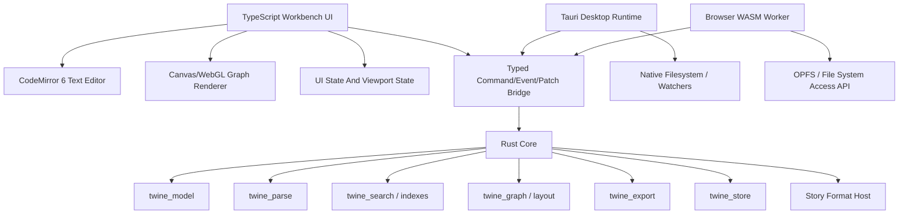

# twine.rs Dream Stack And Strategy

This reference captures the preferred stack and migration strategy: Tauri 2, a pure Rust core, React/Vite/TypeScript UI, CodeMirror 6, virtualized graph rendering, and WASM as the browser-mode core target.

This project should not be "TwineJS rewritten in Rust" as a single heroic port. The strongest version is a new Twine-aware creative IDE: Rust owns the project model, parsing, indexing, graph intelligence, build pipeline, filesystem, and performance-sensitive work; a modern TypeScript web UI owns the dense interactive workbench, editor, accessibility, keyboard UX, and visual polish.

The dream is not pure Rust UI and not pure web app. It is a Rust-native core with a first-class desktop shell, a shared browser target through WASM, and a UI that can move quickly enough to become beautiful.

> **Companion roadmaps:** the feature milestones live in [`TWINE_RS_MILESTONES.md`](./TWINE_RS_MILESTONES.md) (M-series) and the UI-realization track lives in [`TWINE_RS_DESIGN_SYSTEM_SPINE.md`](./TWINE_RS_DESIGN_SYSTEM_SPINE.md) (D-series), which installs `docs/design-system/` as the app's actual UI. The architecture below is the *why*; those docs are the *when*.

## Executive Decision

Recommended target:

- Desktop app: Tauri 2
- Backend/core: Rust workspace crates
- Frontend: TypeScript + Vite
- UI framework: React + Vite first
- Future UI option: Svelte 5 only if a later rewrite or experimental shell justifies the cost
- Editor: CodeMirror 6
- Graph: virtualized DOM cards plus Canvas/WebGL edge and viewport layers
- Browser mode: same UI, Rust core compiled to WASM and run in a Web Worker
- Project storage: directory-first, text-first, graph-metadata-optional
- Type boundary: generated TypeScript types from Rust command/event schemas

This gives you a serious desktop app, not an Electron-shaped web page with a faster parser. But it also preserves the best parts of the web platform: CodeMirror, CSS, mature accessibility primitives, layout, fast UI iteration, Playwright testing, and the ability to run a browser version later.

## Product Stack Decision: React First

For this specific project, React is the best first implementation choice.

Svelte 5 is still an excellent framework. If this were a pure greenfield app with no existing TwineJS code, no React-shaped design system, and no need to keep migration steps close to the current product, Svelte would be a very serious contender.

But twine.rs has different constraints:

- Current TwineJS is already React.
- The new design system is already React/JSX-flavored.
- The UI inventory needs to map existing Twine screens and labels closely.
- A 1:1 migration path matters because the product surface is broad.
- React keeps the team focused on the real risk: Rust backend, project model, performance, text editing, graph virtualization, and story format compatibility.

So the recommended approach is React + Vite + TypeScript on top of a Rust/Tauri core. Treat Svelte as a respected alternative, not the main line.

## The Shape Of The System



The rule: UI state stays in the UI. Story truth stays in Rust.

Examples:

- Current selected passage: UI state.
- Current editor tab list: UI state, persisted as workspace preference.
- Passage title/body/tags/links: Rust project state.
- Diagnostics/search/backlinks: Rust-derived indexes.
- Generated layout: Rust-derived view data.
- Saved graph positions: optional project metadata.
- Text edits: UI streams edit operations; Rust returns patches, diagnostics, changed graph facts, and dirty status.

## Why This Is The Dream Stack

### Tauri 2 For Desktop

Tauri is the right desktop shell because it lets the app use a system WebView for the interface while Rust handles native capability and backend logic. Official Tauri docs describe it as a WebView-based app toolkit that can use any frontend framework compiling to HTML, CSS, and JavaScript, with Rust for backend logic.

What this unlocks:

- Open an actual folder, not just upload files.
- Watch project files for external edits.
- Keep big indexes and caches outside the UI thread.
- Use native dialogs, menus, shortcuts, notifications, and update flow.
- Store huge projects as real directories with text files, assets, story formats, and optional graph metadata.
- Run the same core logic in CLI tests and benchmarks.

Primary docs:

- [Tauri start guide](https://v2.tauri.app/start/)
- [Tauri architecture](https://v2.tauri.app/concept/architecture/)
- [Tauri frontend guide](https://v2.tauri.app/start/frontend/)
- [Tauri security model](https://v2.tauri.app/security/)

### Rust Core For The Hard Parts

Rust should own the work that makes huge projects feel instant:

- Twine/Twee/Harlowe-aware parsing.
- Link extraction and resolution.
- Incremental parse invalidation.
- Passage graph construction.
- Search indexes.
- Symbol indexes.
- Tag indexes.
- Variable and macro analysis.
- Diagnostics.
- Import/export.
- Project folder reads and writes.
- Build pipeline.
- Graph layout generation.
- File watchers.
- Background tasks and cancellation.

The existing skeleton already points in the right direction:

- `twine_model`
- `twine_parse`
- `twine_graph`
- `twine_search`
- `twine_store`
- `twine_export`
- `twine_cli`

The next architectural step is to add a higher-level `twine_core` or `twine_project` crate that orchestrates those crates into one coherent command/query engine.

### TypeScript UI For The Beautiful Workbench

The UI should be a serious web workbench because the required surface area is enormous:

- Code editor.
- Tabs.
- Dock panels.
- Command palette.
- Search result panes.
- Diagnostics drawer.
- Graph viewport.
- Context menus.
- Drag interactions.
- Keyboard shortcuts.
- Form controls.
- Settings.
- Build panels.
- Play/debug surface.
- Asset browser.
- Story format management.

This is exactly where the web platform is strongest.

The design system currently in `docs/design-system/` is already web-native and React-shaped. It uses CSS tokens, JSX components, mock UI kits, Tabler icons, and a workbench layout that can become a real app. That makes React + Vite the correct implementation choice for this project.

Svelte 5 remains worth tracking because it is an excellent dense-UI framework.

Why Svelte 5 is especially attractive:

- It compiles components rather than leaning on a heavier runtime model.
- Its fine-grained reactivity is a good fit for dense IDE surfaces.
- It keeps component code compact.
- It avoids some of the ceremony of React state orchestration.
- It pairs well with CSS-token design systems.

Primary docs:

- [Svelte overview](https://svelte.dev/docs/svelte)
- [Svelte reactivity](https://svelte.dev/docs/svelte/svelte-reactivity)
- [Svelte TypeScript](https://svelte.dev/docs/typescript)

The tradeoff is real: switching to Svelte would mean porting the design system and increasing migration distance from TwineJS. That can be worth it in some projects, but here the better use of energy is making the Rust core and workbench architecture exceptional.

## Svelte, React, Or Pure Rust UI

| Choice          | Best For                                                           | Risk                                                                                       | Verdict                           |
| --------------- | ------------------------------------------------------------------ | ------------------------------------------------------------------------------------------ | --------------------------------- |
| React + Vite    | Fastest path from TwineJS and current design system                | Can become state-management-heavy in a dense IDE                                           | Recommended first choice          |
| Svelte 5 + Vite | Clean long-term UI, compact components, excellent dense reactivity | Requires porting React design system components and moving away from 1:1 migration         | Strong alternative, not main line |
| Leptos/Dioxus   | Rust-first UI experiments and full-stack Rust demos                | Editor ecosystem, DOM integration, graph tooling, accessibility, and hiring/community risk | Not ideal for this app's main UI  |
| Pure WASM UI    | Maximum Rust purity                                                | Slower UI iteration, harder editor integration, weaker design-system ergonomics            | Wrong center of gravity           |

Pure Rust UI frameworks are interesting, but this project wants to be an excellent writing and graph-editing IDE. CodeMirror, web layout, browser accessibility, and TypeScript ecosystem leverage matter more than proving every UI element can be Rust.

WASM should be a core execution target, not the UI framework.

## Where WASM Fits

WASM is absolutely useful, but it should not be the entire app architecture.

Use WASM for browser mode:

- Parse story files.
- Maintain indexes.
- Resolve links.
- Generate diagnostics.
- Run graph layout.
- Export stories.
- Validate project structure.

Run it in a Web Worker so large projects do not freeze the UI. The UI sends commands to the worker; the worker calls the Rust WASM core; the worker returns patches/events.

Desktop mode should use native Rust directly through Tauri commands/events because it can access filesystem, threads, native watchers, and local caches more naturally.

Browser storage options:

- File System Access API where supported, for user-selected project directories.
- Origin Private File System for browser-owned workspaces.
- IndexedDB for caches and fallback persistence.
- Import/export archive flow for unsupported browsers.

Browser mode should be real, but it should be second priority after the desktop app. Huge-project workflows become dramatically better when the app can point at a directory.

## The Core Contract

The project needs a typed command/event/patch boundary early. This is more important than choosing every UI library perfectly.

Suggested protocol:

```rust
enum StoryCommand {
    OpenProject { path: ProjectPath },
    CreateProject { path: ProjectPath, template: ProjectTemplate },
    ApplyTextEdit { file_id: FileId, edits: Vec<TextEdit> },
    RenamePassage { passage_id: PassageId, title: String },
    MovePassage { passage_id: PassageId, position: GraphPosition },
    CreatePassage { title: String, body: String, tags: Vec<String> },
    DeletePassages { passage_ids: Vec<PassageId> },
    SetTags { passage_id: PassageId, tags: Vec<String> },
    BuildStory { target: BuildTarget },
    QuerySearch { query: SearchQuery },
}

enum StoryEvent {
    ProjectOpened(ProjectSnapshot),
    PatchBatch(Vec<ProjectPatch>),
    DiagnosticsUpdated(DiagnosticSummary),
    SearchResultsReady(SearchResults),
    BuildFinished(BuildResult),
    ExternalFileChanged(FileChangeSet),
}
```

Use generated TypeScript types so the UI and Rust core cannot silently drift. Good candidates:

- `specta` / `tauri-specta`
- `ts-rs`

The app should avoid sending giant full-project JSON snapshots after every edit. Use snapshots for initial load and patches for ongoing work.

## Storage Model

The ideal project is directory-first:

```text
My Story/
  twine.toml
  passages/
    start.twee
    forest.twee
    ending.twee
  scripts/
    story.js
  styles/
    story.css
  assets/
    ...
  story-formats/
    ...
  .twine/
    graph.json
    index-cache/
    workspace.json
```

Important principle:

- Text source is authoritative.
- Graph coordinates are optional metadata.
- A project with no graph positions is still completely native.
- A project with graph positions gets graph mode immediately.
- Generated layouts can be viewed without dirtying the source.
- Only explicit layout save writes `.twine/graph.json`.

This gives you both dreams:

- An incredible Twine-aware text editor.
- A dreamy GUI graph editor.

Neither mode is subordinate.

## Editor Stack

Use CodeMirror 6.

It should provide:

- Twee syntax.
- Harlowe syntax overlays.
- Passage header folding.
- Macro highlighting.
- Link highlighting.
- Tag chips in headers.
- Broken link underlines.
- Diagnostics gutter.
- Hover cards for passage references.
- Rename passage refactor.
- Go to passage.
- Find references.
- Backlinks panel.
- Multi-file project search.
- Command palette actions.

Rust should produce the semantic facts. CodeMirror should render and interact with them.

Do not make Rust responsible for every keystroke of highlighting at first. Start with a CodeMirror language extension and feed it Rust-derived project facts asynchronously. Later, move more semantic parsing into incremental Rust if needed.

## Graph Stack

Do not render a huge graph as SVG nodes and edges.

Use:

- DOM or framework components for visible passage cards.
- Canvas2D or WebGL for edges, minimap, selection rectangles, and large-scale visual layers.
- Rust for graph facts, layout, clustering, search, and viewport queries.
- UI framework for toolbar, inspector, popovers, and visible selected nodes.

The target behavior:

- 1k passages feels effortless.
- 10k passages remains interactive.
- 50k passages can be searched, filtered, clustered, navigated, and inspected without trying to draw everything at once.

Graph mode should have levels:

- Overview: clusters, tags, diagnostics, topology.
- Structure: passage boxes and edges.
- Detail: excerpts, tags, variables, notes.
- Focus: selected passage neighborhood.

The graph should be a lens over the source, not a fragile separate truth.

## Story Format Strategy

Story formats are one of the trickiest areas because Twine formats are historically JavaScript/HTML ecosystems.

Short-term:

- Keep compatibility with existing story format packages.
- Let the UI preview/play compiled output in a WebView/browser frame.
- Let Rust handle project assembly, manifest validation, and source preparation.
- Treat editor/dev tooling as separate from the published story runtime even for legacy formats. The first safety rule is that debugging panels, editor UI helpers, HMR clients, and local dev-server glue never ride along in exported HTML unless a manifest explicitly marks them as runtime code.

Medium-term:

- Define a story format capability manifest.
- Separate "build", "preview", "debug", and "publish" capabilities.
- Add a format host boundary so Harlowe forks can declare parser/build/debug affordances.
- Add declared module slots for runtime code, preview-only code, editor/workbench extensions, diagnostics, and devtools. Load editor/dev modules lazily through the host instead of requiring custom formats to inject UI into the story bundle.
- Support local format development folders with dev-server URLs, hot reload/HMR for editor extensions and preview code, source maps, structured logs, and a "reload format" loop that does not require restarting the app.

Long-term:

- Your Harlowe fork can become a first-class format plugin with deep editor intelligence:
  - Macro registry.
  - Syntax grammar.
  - Diagnostics.
  - Autocomplete.
  - Documentation hovers.
  - Variable analysis.
  - Build hooks.
  - Devtools panels.
  - Publish-bundle inspection.

Do not require every story format to be rewritten in Rust. The app should support Rust-native intelligence around JS story formats while making room for deeper Rust-backed formats over time. The contract should make it pleasant to build serious custom format tooling, but strict about which code belongs to the editor, preview/debug environment, and final published story.

## Desktop Vs Browser

Desktop should be the canonical target first.

Desktop-only or desktop-best:

- Open a real project directory.
- Watch files.
- Fast native caches.
- Large local assets.
- External editor interop.
- Git integration.
- Native menus and shortcuts.
- Native export locations.
- Local story format development.
- Better huge-project performance.

Browser-capable:

- Text editing.
- Graph editing.
- Import/export archives.
- OPFS workspaces.
- File System Access API workspaces where supported.
- Play/test in browser.
- WASM parse/index/search.

The browser version is powerful, but it has more storage and permission friction. Design the architecture so browser mode is a target, not a fork.

## Milestone Strategy

### Phase 1: Contract And Real Project Open

Goal: prove the new app spine.

- Add `twine_core` command/event layer.
- Generate TypeScript types from Rust.
- Create a Tauri app shell.
- Import the design system tokens (this is **D0** in the D-series).
- Build Launcher, Workbench shell, and status bar.
- Open a directory.
- Parse a project.
- Show project stats.
- Watch files and refresh diagnostics.

This phase proves that Rust and UI can talk cleanly.

### Phase 2: Text Mode First

Goal: make the app useful even with no graph metadata.

- Add CodeMirror 6.
- Open passage/source files.
- Add Twee/Harlowe highlighting.
- Add passage outline.
- Add link resolution.
- Add broken link diagnostics.
- Add backlinks.
- Add save/dirty state.
- Add project-wide search.

This is the first real product slice. It should feel like a Twine-aware editor, not just a text area.

### Phase 3: Contents, Search, Diagnostics

Goal: make huge projects navigable.

- Build Story Contents view.
- Add filters by tag, broken links, variables, modified state, start passage, orphan status.
- Add command palette.
- Add global search.
- Add diagnostics drawer.
- Add bulk actions.
- Add import/export archive.

This is where the Rust backend starts feeling visibly better than legacy Twine.

### Phase 4: Generated Graph Mode

Goal: graph view works even when source has no positions.

- Generate graph layout from Rust.
- Render overview with Canvas/WebGL edges.
- Render visible passage cards only.
- Add pan/zoom/fit/minimap.
- Add selection sync with text mode.
- Add filters and focus neighborhood.
- Keep generated layout non-dirty.

This validates the modal design: text-only projects still have a native graph lens.

### Phase 5: Saved Graph Editing

Goal: graph becomes authoring, not just viewing.

- Move nodes.
- Create passages.
- Connect passages.
- Rename/delete passages.
- Group passages.
- Add annotations.
- Save graph positions to `.twine/graph.json`.
- Preserve clean source diffs.

Graph editing should write source changes through Rust commands, not mutate text ad hoc in the UI.

### Phase 6: Split Mode

Goal: make text and graph equally native.

- Text selection highlights graph passage.
- Graph selection opens source.
- Link hover previews target.
- Rename passage updates links safely.
- Diagnostics appear in both modes.
- Command palette works across both.

Split mode is the proof that this is not "text editor plus decorative map" or "graph app with source hidden underneath." It is one project with two native representations.

### Phase 7: Build, Play, Debug, Formats

Goal: make it a complete Twine successor.

- Build story.
- Play from start.
- Test from selected passage.
- Export HTML.
- Manage story formats.
- Add custom Harlowe fork support.
- Add format-specific diagnostics/autocomplete/docs.
- Add proofing and statistics.

This phase catches up to Twine's expected publishing loop.

> **D-series ownership:** this phase's UI is realized by the D-series — the Build/Export screen is **D7**, format management is **D6**, and the fully functional preview/debug surface is **D8** (which depends on **D5** graph projection). M6 in [`TWINE_RS_MILESTONES.md`](./TWINE_RS_MILESTONES.md) tracks the engine half (capability manifest, publish-safety, export/package assembly); do not build these screens in legacy chrome.

### Phase 8: Browser Target

Goal: same app architecture, reduced native powers.

- Compile Rust core to WASM.
- Run core in a Web Worker.
- Add OPFS workspace support.
- Add File System Access API support where available.
- Add archive import/export fallback.
- Keep command/event protocol identical.

The browser target should reuse the same UI and most of the same core. If it requires a separate product, the architecture has failed.

## Best Rust Architecture Principles For This App

Use Rust where it creates leverage:

- Strong domain types for IDs, titles, links, passages, tags, files, diagnostics, and graph positions.
- Immutable snapshots plus patch streams.
- Incremental parsing and indexing.
- Clear crate boundaries.
- Cancellation-aware background tasks.
- Deterministic tests and fixtures.
- No UI framework assumptions inside core crates.
- No Tauri assumptions inside pure core crates.
- WASM-compatible core where practical.

Suggested crate evolution:

```text
crates/
  twine_model/        pure data model and IDs
  twine_parse/        Twee/Twine/Harlowe parsing
  twine_project/      project document model, snapshots, patches
  twine_store/        filesystem/project folder persistence
  twine_graph/        graph facts, layout, viewport queries
  twine_search/       text/symbol/tag/link indexes
  twine_diagnostics/  validation and warnings
  twine_export/       build/export assembly
  twine_format/       story format manifests and capabilities
  twine_core/         command/event orchestrator
  twine_wasm/         WASM worker bindings
  twine_tauri/        Tauri command bindings
  twine_cli/          benchmarks and scripts
```

Important boundary:

- `twine_model`, `twine_parse`, `twine_project`, `twine_graph`, `twine_search`, and `twine_export` should not know Tauri exists.
- `twine_tauri` adapts desktop commands to `twine_core`.
- `twine_wasm` adapts browser worker messages to `twine_core`.

## Best UI Architecture Principles

> These principles are realized screen-by-screen in the D-series: design tokens = **D0**, component library = **D1**, app shell / command palette / status bar = **D2**, mode surfaces = **D4/D5**. See [`TWINE_RS_DESIGN_SYSTEM_SPINE.md`](./TWINE_RS_DESIGN_SYSTEM_SPINE.md).

The UI should be command-driven and view-driven, not model-owned.

Use:

- Design tokens as CSS custom properties.
- Component library for controls, panels, tabs, drawers, badges, tags, dialogs.
- One app shell.
- Mode surfaces: Text, Graph, Split.
- Shared command palette.
- Shared inspector.
- Shared diagnostics drawer.
- Shared status bar.
- Local viewport state per mode.
- Rust-backed project state.

Avoid:

- Copying the whole project into multiple frontend stores.
- Rendering thousands of nodes as DOM.
- Letting graph edits bypass source/project commands.
- Mixing persistence logic into UI components.
- Treating browser mode as the primary constraint too early.

## Recommended First Vertical Slice

The first serious slice should be:

1. Tauri shell opens a project directory.
2. Rust parses it and returns a project snapshot.
3. Workbench shows real project name, passage count, link count, dirty state, diagnostics count.
4. Text mode opens a real passage/source file in CodeMirror.
5. Broken links and outgoing links appear from Rust analysis.
6. Save edits and see diagnostics update.
7. Command palette can open passages by title.

This slice connects every critical layer without requiring the whole app.

## Recommendation

Build the dream in this order:

1. Keep the Rust core pure and aggressively tested.
2. Build desktop first with Tauri 2.
3. Use React + Vite + TypeScript for the first real workbench.
4. Keep Svelte 5 as a later experiment, not a blocker.
5. Use CodeMirror 6 for text editing.
6. Use Canvas/WebGL plus virtualization for graph mode.
7. Use WASM for browser mode and shared core execution, not for the whole UI.
8. Make text mode excellent before graph editing becomes authoritative.
9. Make graph mode work with generated layouts before saved positions.
10. Make every operation go through typed Rust commands and patch events.

The ideal identity of twine.rs is: "a native-feeling, directory-first, text-and-graph Twine IDE with a Rust brain and a beautiful web workbench face."
