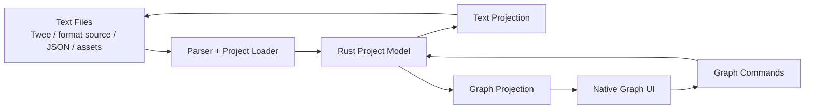

# twine.rs UI Document

This reference describes the target mode-native UI: Text, Graph, and Split workspaces over one Rust project model. The companion design system in `docs/design-system/` is the **UI source of truth**, and [`TWINE_RS_DESIGN_SYSTEM_SPINE.md`](./TWINE_RS_DESIGN_SYSTEM_SPINE.md) (the D-series) is the roadmap that installs it as the app's real UI. The screens described below map to D-milestones: Main Workspace Shell + Command Palette → **D2**; Project Launcher + New Project → **D3**; Text Mode → **D4**; Graph Mode + Split → **D5**; Contents, Diagnostics, Asset Manager, Story Formats → **D6**; Build/Export/Publish + Settings → **D7**; Play/Test/Debug → **D8**. D0–D2 (tokens, primitives, app shell) are prerequisites for every screen below; build in that order.

## Product Thesis

`twine.rs` should be a mode-native editor:

- A text/file workspace for authors who want decompiled, versionable, scriptable source.
- A native story graph workspace for authors who think spatially and want direct manipulation.
- A split workspace for authors who want both projections synchronized at once.

All modes edit the same project. None of them is an export-only afterthought.

The app should feel like an IDE for interactive fiction: fast, inspectable, keyboard-friendly, text-native, graph-native, and comfortable with very large stories.

## Core Principle

There is one canonical Rust project model, with multiple projections:



Text editing and graph editing should produce typed project patches. The Rust core validates and applies those patches, then publishes updated projections back to the UI.

Story content, author-defined passage hierarchy, and graph layout must be separable. A project can be source-only with no saved passage positions, graph-backed with rich layout metadata, or mixed. Textual story data is canonical. Folders, sections, chapters, books, and other scopes organize passages and source files without changing link semantics. Graph positions, card sizes, visual groups, annotations, and view state are optional metadata that can be generated, edited, and persisted only when the author wants them.

## First Screen

No landing page. Opening the app lands in the project workspace.

Default layout:

- Left: project explorer.
- Center: last-used or project-preferred mode: Text, Graph, or Split.
- Right: inspector or text editor, depending on selection.
- Bottom: diagnostics/search/results drawer.
- Top: compact command bar with project, graph, search, play/test, export.

The first viewport should communicate: this is a serious Twine-aware text editor and a serious native graph editor. Projects without saved positions should open cleanly in Text mode and offer generated Graph mode, not look broken.

## Primary Views

### 1. Text Workspace

The text workspace is the base authoring surface. A project with no story positions, no graph metadata, and no saved layout should still feel complete.

Expected capabilities:

- Project file tree.
- Open many files/tabs.
- Split panes.
- Passage source editing.
- Story metadata editing.
- Format-specific syntax highlighting.
- Find/replace across project.
- Rename symbols/passages with link updates.
- Go to passage, backlinks, references.
- Variables, tags, and outgoing links in the outline/inspector.
- Diagnostics inline and in the bottom drawer.
- Git-friendly file layout.
- Build, preview, proof, test, and export without opening graph mode.

Supported source forms:

- Single-file Twee.
- Multi-file project directory.
- Format-specific source files for the user's Harlowe fork.
- JSON project snapshot for tooling/debugging.
- Assets directory.

### 2. Graph View

The graph is a native authoring surface, not a required storage format. If saved positions exist, load them. If they do not, generate a temporary layout and clearly show Save Layout / Keep Text-Only choices.

Expected capabilities:

- Pan and zoom instantly on 10k+ passages.
- Render visible passages only.
- Render links via canvas/WebGL, not thousands of DOM/SVG nodes.
- Drag passages or groups.
- Create passages by double-click, keyboard command, or connector drag.
- Select by click, shift-click, lasso, tag, query, or search result.
- Toggle link overlays: normal links, broken links, references, backlinks, variables, diagnostics.
- Collapse groups/folders/subgraphs.
- Scope the graph to a folder, section, chapter, book, or saved organization view so authors can work on relevant passages without drawing the entire story at once.
- Show cross-scope links as boundary edges, neighbor badges, or optional one-hop context instead of hiding structural problems.
- Show minimap for large projects.
- Generate a non-destructive layout for source-only projects.
- Persist graph coordinates only after an explicit save/layout action.

Graph cards should be compact and scannable:

- Title
- Tags
- Short excerpt or diagnostic badge
- Link count / broken-link badge
- Status indicators for changed, generated, excluded, or asset-backed passages

### 3. Split View

Split view is the signature UI.

Author can place graph and text side by side:

- Selecting a passage in the graph opens its source.
- Moving cursor inside a passage source highlights the node.
- Editing a `[[Link]]` updates link previews.
- Clicking a broken link diagnostic jumps to source and graph edge.
- Dragging a node updates metadata in source without destroying hand formatting where possible.

This is the “decompiled plus native” promise.

### 4. Contents View

A project-level index for big stories.

Sections:

- Folders / Chapters / Books
- Passages
- Tags
- Variables
- Assets
- Broken links
- Orphans
- Entry points
- Scripts/stylesheets
- Story metadata
- Export/publish targets

This view should be backed by Rust indexes, so it remains instant on huge projects. It should let authors create, rename, reorder, nest, and bulk-move passages between folders/chapters/books without relying on external Tweego project conventions.

### 5. Diagnostics View

Diagnostics should feel like a compiler/language-server panel:

- Broken links
- Duplicate names
- Missing assets
- Invalid variables/macros
- Cycles or unreachable passages
- Format-specific warnings
- Export blockers

Every diagnostic should have:

- Severity
- Location
- Explanation
- Fix action when possible

## Detailed Screen Goals and UI Inventory

This section is a product/UI spot check and a more explicit target spec. The current Twine app is toolbar-and-dialog driven. The important existing labels to preserve conceptually are:

- Library toolbar tabs: `Story`, `Library`, `Build`, `View`, `Twine`.
- Library actions: `New`, `Edit`, `Tags`, `Rename`, `Duplicate`, `Delete`, `Story Tags`, `Import`, `Archive`, `Sort By`, `Show Tags`, `Show All Stories`, `Play`, `Test`, `Proof`, `Publish to File`, `Export As Twee`, `Preferences`, `Story Formats`, `About Twine`, `Report a Bug`.
- Story map toolbar tabs: `Passage`, `Story`, `Build`, `Twine`.
- Passage actions: `New`, `Edit`, `Rename`, `Delete`, `Test From Here`, `Start Story Here`, `Go To`, `Select All`, `Deselect All`.
- Story actions: `Find and Replace`, `Details`, `Passage Tags`, `JavaScript`, `Stylesheet`.
- Existing dialogs and field labels: `Preferences`, `Language`, `Theme`, `Dialog Width`, `Show Passage Tags As`, `Use Enhanced Editors`, `Passage Editor Font`, `Code Editor Font`, `Import Stories`, `Story Formats`, `Find and Replace`, `Find`, `Replace With`, `Include Passage Names`, `Match Case`, `Use Regular Expressions`, `Replace In All Passages`, `Story Statistics`, `Broken Links`, `Passages`, `Words`, `Characters`, `Links`, `Snap To Grid`.

The target UI should keep the plain-language clarity of these labels, but reorganize them into a mode-native workbench instead of scattering core workflows across dialogs.

### Overall Style

Goal: make `twine.rs` feel like a serious creative IDE, not a marketing site and not a toy clone. It should be quiet, fast, dense enough for large projects, and still welcoming to writers.

Visual style:

- Workbench layout with clear top command bar, left navigation, center authoring mode, right inspector, bottom drawer, and optional status bar.
- Compact controls, restrained borders, small radius, strong focus rings, readable typography, and no decorative noise.
- Neutral editor background with restrained accent colors for selection, links, warnings, tags, and format/plugin status.
- Text-heavy screens should feel like a code editor or writing app. Graph-heavy screens should feel spatial and tactile.
- Avoid a single-hue palette. Use separate semantic colors for links, tags, warnings, errors, generated layout, saved layout, dirty state, and build status.
- Buttons should use icon plus tooltip for repeated tools, and text labels for decisive commands like `Import`, `Export HTML`, `Save Layout`, `Merge`, `Delete`, and `Publish`.
- Long labels must fit. Toolbars should collapse into menus at smaller widths rather than wrapping awkwardly.

Interaction style:

- Everything important should be reachable by command palette and keyboard.
- Text mode must be fully usable without graph mode.
- Graph mode must be fully usable without source tabs open.
- Split mode should make the two feel synchronized, not duplicated.
- Modal dialogs should be reserved for narrow confirmations and focused prompts. Authoring belongs in modes, docks, tabs, and drawers.

### Project Launcher

Screen goal: help the user find, create, import, inspect, and safely open projects. This is the home base for project ownership.

User needs to be able to:

- Create a new project.
- Open an existing project folder.
- Import Twine HTML, Twee, JSON, archive, or older Twine material.
- See where every project lives on disk.
- Understand whether a project is text-only, graph-backed, or mixed.
- See backup, Git, dirty, build, broken-link, and story-format health before opening.
- Search, sort, filter, favorite, archive, and remove projects.

Visible UI elements:

- Left rail: `Recent`, `Favorites`, `Examples`, `Templates`, `Archived`.
- Top command bar: `New Project`, `Open Folder`, `Import`, `Search Projects`, `Sort`, `Filter`, `Settings`.
- View toggle: `Table`, `Cards`.
- Project table columns: `Name`, `Path`, `Mode`, `Format`, `Passages`, `Words`, `Assets`, `Broken Links`, `Last Modified`, `Git`, `Backup`, `Last Build`.
- Project card fields: title, path, format badge, mode badge, passage count, word count, broken-link badge, saved layout badge, backup badge.
- Empty state actions: `New Project`, `Open Existing Folder`, `Import Twine HTML/Twee`, `Try Sample Project`.
- Context menu actions: `Open`, `Open in Text Mode`, `Open in Graph Mode`, `Open in Split Mode`, `Reveal in Finder`, `Duplicate`, `Archive`, `Remove from Recent`.

Important labels:

- `Local Only`
- `Backed Up`
- `No Backup Yet`
- `Unsaved Changes`
- `Source-Only`
- `Saved Layout`
- `Generated Layout Available`
- `Format Missing`
- `Broken Links`
- `Open Recent`

Core success condition: a user can tell at a glance what a project is, where it is, how healthy it is, and which mode will open.

### New Project

Screen goal: create a valid source-first project with optional graph layout from the beginning.

User needs to be able to:

- Name the project.
- Pick the folder.
- Pick a story format, including custom Harlowe forks.
- Choose source layout.
- Choose initial mode.
- Create from blank, example, or template.
- Understand the exact files that will be written.

Visible UI elements:

- Fields: `Project Name`, `Project Folder`, `Story Format`, `Format Version`, `Template`, `Source Layout`, `Initial Mode`, `Start Passage Name`.
- Source layout options: `Single-file Twee`, `Multi-file Project`, `Import Existing Source`.
- Initial mode options: `Text`, `Graph`, `Split`.
- Graph layout option: `Create Empty Graph Layout` checkbox.
- Preview panel: file tree showing `twine.toml`, `story.twee` or `passages/`, `scripts/`, `styles/`, `assets/`, optional `.twine/graph.json`.
- Footer actions: `Create Project`, `Cancel`.

Important labels:

- `Recommended`
- `No graph layout will be saved yet`
- `Graph layout can be generated later`
- `This folder already contains files`
- `Format supports editor extensions`
- `Format compatibility unknown`

Core success condition: a user can create a clean project without accidentally committing to graph metadata or hidden storage.

### Main Workspace Shell

Screen goal: provide the stable workbench that all authoring modes share.

User needs to be able to:

- Switch between `Text`, `Graph`, and `Split`.
- Search commands and project content.
- See project state, mode state, dirty state, diagnostics, and build state.
- Collapse or resize panels.
- Recover quickly from large-project navigation.

Visible UI elements:

- Top command bar: project name, path breadcrumb, mode segmented control `Text | Graph | Split`, `Play`, `Test`, `Proof`, `Export`, `Command Palette`, dirty indicator, diagnostics badge.
- Left dock tabs: `Files`, `Contents`, `Search`, `Assets`.
- Center area: current mode surface.
- Right dock tabs: `Inspector`, `Outline`, `Backlinks`, `Format`.
- Bottom drawer tabs: `Diagnostics`, `Search Results`, `Build Output`, `Logs`.
- Status bar: current file/passage, cursor position, selected passage count, index status, save status, active format.

Important labels:

- `Saved`
- `Saving...`
- `Unsaved`
- `Indexing`
- `Ready`
- `Generated Layout`
- `Saved Layout`
- `Source-Only Project`
- `Rebuild Indexes`
- `Open Command Palette`

Core success condition: no screen feels stranded. The user always knows where they are, what mode they are in, and what changed.

### Text Mode

Screen goal: be an incredible Twine-aware text editor, complete even for projects with no graph positions.

User needs to be able to:

- Edit passage text and metadata.
- Navigate passages, files, tags, variables, links, and backlinks.
- Rename passages safely.
- Create/delete/move passages in files.
- Edit scripts, styles, and story metadata.
- Use find/replace, diagnostics, autocomplete, folding, spellcheck, snippets, and format-specific tooling.
- Build, preview, test, proof, and export without opening graph mode.

Visible UI elements:

- File tree with roots: `twine.toml`, `story.twee`, `passages/`, `scripts/`, `styles/`, `assets/`, `.twine/`.
- Editor tab strip with file tabs and dirty markers.
- Editor header: passage/file name, source path, format badge, diagnostics count, backlinks count, outgoing links count.
- Editor gutter: line numbers, diagnostics markers, fold controls, change markers.
- Inline UI: autocomplete popover, link hover preview, variable hover, broken-link squiggle, quick fix menu.
- Right outline: `Metadata`, `Tags`, `Outgoing Links`, `Backlinks`, `Variables`, `Assets`, `Diagnostics`.
- Bottom drawer: project search, diagnostics, build output.

Primary labels/actions:

- `New Passage`
- `Rename Passage`
- `Go to Passage`
- `Find References`
- `Show Backlinks`
- `Insert Link`
- `Extract Passage`
- `Move to File`
- `Format Passage`
- `Preview Passage`
- `Test From Here`
- `Reveal in Graph`
- `Generate Graph Layout`

Source-only states:

- `No saved graph layout`
- `Generate temporary graph`
- `Keep text-only`
- `Save layout metadata`

Core success condition: a user can write and maintain a huge Twine project like a real source code project.

### Graph Mode

Screen goal: provide a dreamy native story graph editor for spatial authoring and structural understanding.

User needs to be able to:

- See the story structure.
- Pan and zoom huge graphs smoothly.
- Create, select, drag, resize, align, group, tag, delete, and link passages.
- Focus the graph on one folder, chapter, book, or saved scope while preserving whole-story context.
- Toggle link layers and diagnostics layers.
- Work with saved layout metadata or generated layout.
- Reveal graph selections in source.

Visible UI elements:

- Full graph canvas with subtle grid.
- Scope breadcrumb/menu: `All Passages`, book, chapter, folder, saved view.
- Floating graph toolbar: `Select`, `Pan`, `New Passage`, `Connect`, `Group`, `Annotate`, `Align`, `Distribute`, `Snap`, `Layers`, `Layout`.
- Zoom control: `Zoom Out`, zoom percentage, `Zoom In`, `Fit`, `Names Only`, `Names + Excerpts`, `Structure Only`.
- Layer toggles: `Links`, `Cross-Scope Links`, `Broken Links`, `Backlinks`, `Variables`, `Diagnostics`, `Tags`, `Groups`, `Annotations`.
- Minimap with viewport rectangle.
- Node cards: title, tags, excerpt, outgoing count, broken-link badge, asset badge, generated/saved layout status.
- Selection HUD: selected count, bulk actions.
- Layout status chip: `Saved Layout`, `Generated Layout`, `Unsaved Layout`.
- Empty canvas prompt for source-only projects: `Generate Layout`, `Keep Text-Only`.

Primary labels/actions:

- `Save Layout`
- `Discard Layout Changes`
- `Auto Layout`
- `Fit Selection`
- `Reveal in Source`
- `Open Inspector`
- `Create Link`
- `Create Passage Here`
- `Collapse Group`
- `Expand Group`
- `Align Left`
- `Distribute Horizontally`
- `Snap to Grid`
- `Hide Links`
- `Show Selected Neighborhood`
- `Show Chapter`
- `Show Book`
- `Show One-Hop Neighbors`

Core success condition: graph mode feels fast, direct, and optional; it never punishes projects that started as text.

### Split Mode

Screen goal: make text and graph feel like two synchronized views of one project.

User needs to be able to:

- Select a graph node and edit its source immediately.
- Move the cursor in source and see graph context.
- Edit links in source and see edges update.
- Create links in graph and insert source snippets safely.
- Resolve diagnostics from either projection.

Visible UI elements:

- Resizable graph pane.
- Resizable editor pane.
- Optional shared inspector.
- Sync controls: `Follow Source`, `Follow Graph`, `Pin Selection`, `Reveal Both`.
- Conflict/status chip: `Synced`, `Graph layout unsaved`, `Source changed externally`, `Generated layout`.
- Diagnostic cross-highlight between source span and graph edge/node.

Primary labels/actions:

- `Reveal Both`
- `Follow Cursor`
- `Follow Selection`
- `Pin Passage`
- `Open in Text Mode`
- `Open in Graph Mode`
- `Place Link Snippet`
- `Save Layout`

Core success condition: split mode is the showcase, but it does not become a requirement for either text authors or graph authors.

### Contents Navigator

Screen goal: give large projects a durable, indexed table of contents.

User needs to be able to:

- Browse every story element quickly.
- Filter by type, tag, issue, folder, chapter, book, format role, and build status.
- See counts and health state.
- Jump to source and graph.
- Bulk-select and bulk-edit.
- Create, rename, reorder, nest, and bulk-move passages across folders/chapters/books.

Visible UI elements:

- Search field: `Filter contents`.
- Type tabs: `All`, `Passages`, `Chapters`, `Books`, `Tags`, `Variables`, `Assets`, `Scripts`, `Styles`, `Groups`, `Diagnostics`.
- Tree/list rows with icons, names, counts, badges, and actions.
- Count badges: passage count, backlink count, outgoing link count, asset reference count.
- Problem groups: `Broken Links`, `Orphans`, `Duplicate Names`, `Missing Assets`, `Unreachable`, `Excluded from Publish`.

Primary labels/actions:

- `Reveal in Source`
- `Reveal in Graph`
- `Select in Graph`
- `Show Scoped Graph`
- `Move to Chapter`
- `Bulk Tag`
- `Export Selection`
- `Mark as Start`
- `Exclude from Publish`
- `Include in Publish`

Core success condition: a 50k-passage project feels searchable and organized, not like a giant canvas problem.

### Passage Inspector

Screen goal: expose structured passage information and safe bulk operations.

User needs to be able to:

- Understand the selected passage or selection set.
- Edit tags and metadata.
- Inspect links, backlinks, variables, assets, diagnostics, source path, and graph metadata.
- Run common operations without leaving the current mode.

Visible UI elements:

- Header: passage title, source path, mode/layout badges.
- Fields: `Title`, `Tags`, `Source File`, `Start Passage`, `Publish`, `Graph Position`, `Card Size`.
- Sections: `Outgoing Links`, `Backlinks`, `Variables`, `Assets`, `Diagnostics`, `History`.
- Multi-select section: selected count, shared tags, mixed values, bulk actions.

Primary labels/actions:

- `Rename`
- `Add Tag`
- `Remove Tag`
- `Set as Start`
- `Test From Here`
- `Reveal Source`
- `Reveal Graph`
- `Copy Passage ID`
- `Align`
- `Group`
- `Delete`

Core success condition: the inspector makes structure visible without forcing users into modal dialogs.

### Command Palette

Screen goal: make the whole app keyboard reachable.

User needs to be able to:

- Run commands.
- Open passages/files/settings.
- Jump to tags, variables, assets, and diagnostics.
- Switch modes.
- Trigger build/export tasks.

Visible UI elements:

- Center overlay input: `Type a command, passage, file, tag, variable, asset, or setting`.
- Grouped results: `Commands`, `Passages`, `Files`, `Tags`, `Variables`, `Assets`, `Diagnostics`, `Settings`.
- Each row: icon, label, secondary path/detail, keyboard shortcut if any.

Primary labels/actions:

- `Switch to Text Mode`
- `Switch to Graph Mode`
- `Switch to Split Mode`
- `Create Passage`
- `Open Passage`
- `Rename Passage`
- `Find Variable`
- `Show Broken Links`
- `Generate Layout`
- `Rebuild Indexes`
- `Export HTML`
- `Open Settings`

Core success condition: expert users can move at thought-speed without hunting through toolbars.

### Search and Replace

Screen goal: make search a project index, not just a modal count.

User needs to be able to:

- Search passage titles, body text, tags, variables, files, assets, diagnostics, and proof output.
- Replace safely with preview.
- Jump to each result in source and graph.
- Select or tag result sets.

Visible UI elements:

- Query input: `Find`.
- Replace input: `Replace With`.
- Scope chips: `Text`, `Titles`, `Tags`, `Variables`, `Files`, `Assets`, `Diagnostics`, `Proof`.
- Options: `Match Case`, `Use Regular Expressions`, `Whole Word`, `Include Generated`.
- Results grouped by file/passage with snippets.
- Footer: result count, selected count, replace preview actions.

Primary labels/actions:

- `Replace Selected`
- `Replace All`
- `Preview Replace`
- `Reveal in Source`
- `Reveal in Graph`
- `Select Results`
- `Tag Results`
- `Export Results`

Core success condition: search supports navigation, editing, auditing, and bulk operations.

### Diagnostics

Screen goal: make project problems visible, explainable, and fixable.

User needs to be able to:

- See all warnings/errors.
- Filter by severity and type.
- Jump to exact source locations.
- Jump to graph locations when available.
- Apply safe fixes.

Visible UI elements:

- Severity filter: `Errors`, `Warnings`, `Info`.
- Type filter: `Broken Links`, `Missing Assets`, `Duplicate Names`, `Invalid Metadata`, `Format Errors`, `Export Blockers`.
- Diagnostic rows: severity icon, message, file/passage, source span, graph badge, quick fix.
- Detail panel with explanation and proposed fix.

Primary labels/actions:

- `Fix`
- `Fix All Safe`
- `Ignore`
- `Reveal Source`
- `Reveal Graph`
- `Open Format Docs`
- `Recheck Project`

Core success condition: diagnostics feel like a language server and compiler, not like vague warnings.

### Asset Manager

Screen goal: make media and static resources file-backed and inspectable.

User needs to be able to:

- Import and organize assets.
- Preview assets.
- Insert references into source.
- Find usages.
- Detect missing/unused assets.
- Package assets correctly at export time.

Visible UI elements:

- Toolbar: `Import Asset`, `New Folder`, `Search Assets`, `Filter`, `Sort`, `Find Unused`.
- Table/grid columns: `Preview`, `Name`, `Type`, `Size`, `Dimensions`, `References`, `Used`, `Modified`, `Publish`.
- Preview pane for image/audio/video/text where possible.
- Usage list with source spans.
- Missing/unused warnings.

Primary labels/actions:

- `Copy Snippet`
- `Insert into Passage`
- `Find Usages`
- `Reveal in Folder`
- `Rename`
- `Replace File`
- `Delete`
- `Mark for Publish`
- `Exclude from Publish`

Core success condition: assets behave like normal project files, not hidden blobs or fragile pasted paths.

### Story Formats

Screen goal: manage format capabilities and custom format tooling.

User needs to be able to:

- Add, remove, update, and select story formats.
- Understand whether a format supports syntax, autocomplete, diagnostics, build, proofing, and editor extensions.
- Manage custom Harlowe forks.
- Develop local custom formats without bundling devtools or editor UI helpers into the final story.
- Connect local format folders/dev servers, lazy-load editor extensions, use HMR/live reload where available, and inspect what will be included in publish output.
- Open docs and compatibility notes.

Visible UI elements:

- Format list with cards or table rows.
- Filters: `All`, `Current`, `Built In`, `User Added`, `Local Dev`, `Needs Update`, `Failed`.
- Format row badges: `Default`, `Proofing`, `Editor Extensions`, `Dev Tools`, `Parser`, `Exporter`, `Diagnostics`, `Autocomplete`, `HMR`, `Lazy Loaded`, `Publish Safe`.
- Detail panel: author, version, license, docs URL, capabilities, compatibility status, dev-server status, bundle inclusion policy, and editor/runtime module split.

Primary labels/actions:

- `Add Story Format`
- `Open Format Folder`
- `Connect Dev Server`
- `Reload Format`
- `Use as Default`
- `Use for Proofing`
- `Enable Editor Extensions`
- `Disable Editor Extensions`
- `Enable Dev Tools`
- `Disable Dev Tools`
- `Inspect Publish Bundle`
- `Update Format`
- `Remove`
- `Open Documentation`
- `Validate Format`

Core success condition: story formats feel like typed plugins with declared abilities, not opaque blobs. Format authors can add rich editor/dev UI and debug tooling without fighting Twine or accidentally shipping that tooling inside the final playable story.

### Build, Export, and Publish

Screen goal: turn a project into playable/proofable/publishable outputs with visible blockers.

User needs to be able to:

- Play the story.
- Test from a passage.
- Generate proofing copy.
- Export HTML, Twee, JSON, archive/package, and publish targets.
- See warnings, blockers, output files, and logs.

Visible UI elements:

- Target list: `Play`, `Test From Selection`, `Proof`, `Validate`, `Export HTML`, `Export Twee`, `Export JSON`, `Package Project`, `Publish`.
- Target detail: format, output path, last run, warnings, options, estimated output files.
- Build output drawer with streaming logs.
- Warning summary and fix links.

Primary labels/actions:

- `Run`
- `Run Again`
- `Choose Output Folder`
- `Open Output`
- `Reveal Output`
- `Copy Share Link`
- `Validate Before Export`
- `Include Assets`
- `Exclude Marked Passages`

Core success condition: users know exactly what will be generated and what must be fixed first.

### Play, Test, and Debug

Screen goal: integrate runtime testing with source and graph context.

User needs to be able to:

- Play from the start.
- Test from a selected passage.
- Restart and inspect runtime state.
- Jump from runtime passage back to source and graph.
- Read logs/errors.

Visible UI elements:

- Runtime preview frame.
- Debug strip: `Restart`, `Back`, `Current Passage`, `Visited`, `Variables`, `Console`, `Open Source`, `Reveal Graph`.
- Viewport controls: responsive sizes, zoom, reload.
- Error overlay linking to source spans.

Primary labels/actions:

- `Restart`
- `Test From Here`
- `Open Current Passage`
- `Reveal Current Passage`
- `Copy Runtime Log`
- `Clear State`

Core success condition: testing feels attached to authoring, not like a separate browser page.

### Import and Migration Review

Screen goal: import without losing data or hiding decisions.

User needs to be able to:

- Inspect detected stories before import.
- Preserve metadata and unknown fields.
- Decide how to handle conflicts.
- Convert to source layout.
- Preserve or generate graph layout.
- Map assets.

Visible UI elements:

- Left pane: source files and import summary.
- Center pane: detected stories, passages, formats, assets, metadata, graph positions.
- Right pane: conflicts, warnings, decisions.
- Decision controls: `Import as New Project`, `Merge into Current Project`, `Convert to Multi-file`, `Preserve Layout`, `Generate Layout`, `Keep Text-Only`.
- Review table: item name, type, action, conflict state.

Primary labels/actions:

- `Choose Files`
- `Import Selected`
- `Import Different File`
- `Resolve Conflict`
- `Keep Existing`
- `Use Imported`
- `Rename Imported`
- `Preserve Unknown Metadata`
- `Run Import`

Core success condition: import is transparent, reviewable, and non-destructive.

### Settings

Screen goal: make app behavior, accessibility, storage, modes, formats, and integrations discoverable.

User needs to be able to:

- Configure editor, graph, modes, storage, backups, keyboard, accessibility, formats, build, and integrations.
- Understand where projects and backups live.
- Customize shortcuts.
- Reduce motion and support high contrast.
- Configure external editor and revision/cloud hooks.

Visible UI elements:

- Search field: `Search Settings`.
- Left settings nav: `General`, `Workspace`, `Modes`, `Editor`, `Graph`, `Accessibility`, `Keyboard Shortcuts`, `Storage`, `Backups`, `Story Formats`, `Build`, `Integrations`, `Platform`, `About`.
- General controls: language, theme, startup project behavior.
- Modes controls: default startup mode, per-project mode memory, generated-layout behavior.
- Editor controls: font, size, tabs/spaces, wrapping, spellcheck, folding, snippets.
- Graph controls: grid, snap, link layers, animation, minimap, generated layout defaults.
- Accessibility controls: reduced motion, high contrast, focus mode, cursor blink, keyboard-only controls.
- Storage/Backups controls: default project folder, cache cleanup, backup cadence, backup location.

Primary labels/actions:

- `Default Startup Mode`
- `Remember Mode Per Project`
- `Generate Graph Layout On Demand`
- `Ask Before Saving Layout Metadata`
- `Reduced Motion`
- `High Contrast`
- `Keyboard Shortcuts`
- `Set Project Folder`
- `Clean Cache`
- `Open Backups Folder`
- `Test External Editor`
- `Check for Updates`

Core success condition: reliability and accessibility controls are not hidden; they are part of the main product.

## Existing UI Option Coverage Matrix

This matrix is the spot-check promise: current Twine options should either survive directly, move to a better home, or become part of a richer workflow. The redesign should not accidentally drop old affordances just because the architecture changes.

| Existing UI area                      | Current options and labels                                                                                                                                                          | New-world redesign                                                                                                                                                                                                                                              |
| ------------------------------------- | ----------------------------------------------------------------------------------------------------------------------------------------------------------------------------------- | --------------------------------------------------------------------------------------------------------------------------------------------------------------------------------------------------------------------------------------------------------------- |
| First-run welcome                     | `Hi!`, `Tell Me More`, `Go to the Story List`, `Your work is automatically saved`, `Your work is only saved in your browser`, `New here?`                                           | Replace the passive welcome flow with a Project Launcher that still explains storage. Keep first-run education as a compact `Storage and Backups` card with actions: `Choose Project Folder`, `Import Existing Story`, `Try Sample Project`, `Open Docs`.       |
| Story library heading and empty state | `Stories`, `No Stories`, `No Tagged Stories`, `There are no stories saved... create a new story or import...`                                                                       | Project dashboard with `Recent`, `Favorites`, `Examples`, `Templates`, `Archived`, plus clear project cards/table rows. Empty state becomes actionable: `New Project`, `Open Folder`, `Import Twine HTML/Twee`, `Try Sample Project`.                           |
| Story cards                           | Story preview mini-map, story name, `Last edited on`, passage count, story tags, selectable/double-clickable card                                                                   | Project card/table with more metadata: path, preferred mode, saved layout state, story format, passages, words, assets, broken links, Git state, backup state, last build. Mini-map appears only when saved/generated layout exists.                            |
| Library storage warnings              | `StorageQuota`, `% space available`, Safari warning, `Archive and use another browser`, `Add this site to your home screen`                                                         | Browser mode keeps storage health prominently. Desktop mode replaces quota anxiety with `Project Folder`, `Backup Status`, `Disk Location`, `Open Backups Folder`, `Clean Cache`.                                                                               |
| Story toolbar tab in library          | `New`, `Edit`, `Tags`, `Rename`, `Duplicate`, `Delete`                                                                                                                              | Project/Story actions move to context menu, command palette, and top toolbar: `New Project`, `Open`, `Rename`, `Duplicate`, `Tag`, `Archive`, `Delete`. Story-specific actions remain available when a project contains multiple stories.                       |
| New story prompt                      | `What should your story be named? You can change this later.`, `Untitled Story`                                                                                                     | Full New Project/New Story screen with `Project Name`, `Story Name`, `Project Folder`, `Story Format`, `Source Layout`, `Initial Mode`, `Create Project`.                                                                                                       |
| Delete story prompt                   | Web: deleted forever. Desktop: moved to trash.                                                                                                                                      | Keep platform-specific deletion language. Desktop uses OS trash where possible. Browser requires stronger confirmation and recommends export/archive first. Add `Archive Instead` when appropriate.                                                             |
| Library tab                           | `Story Tags`, `Import`, `Archive`                                                                                                                                                   | `Story Tags` becomes part of Contents/Tags. `Import` becomes Import/Migration Review. `Archive` becomes `Export Archive` or `Backup Now`, depending on platform.                                                                                                |
| Build tab                             | `Test`, `Play`, `Proof`, `Publish to File`, `Export As Twee`                                                                                                                        | Build workspace with targets: `Play`, `Test From Selection`, `Proof`, `Validate`, `Export HTML`, `Export Twee`, `Export JSON`, `Package Project`, `Publish`. Each target has warnings, output path, options, and logs.                                          |
| View tab                              | `Sort By`, `Last Updated`, `Name`, `Show Tags`, `Show All Stories`                                                                                                                  | Launcher keeps `Sort`, `Filter`, `Tags`, table/card view. Contents Navigator adds tag filtering and organization filters for large projects.                                                                                                                    |
| App/Twine tab                         | `Preferences`, `Story Formats`, `About Twine`, `Report a Bug`, `Help`                                                                                                               | Settings screen absorbs `Preferences`; Story Formats gets a full capability manager; About/Report Bug remain in `Help`/`About`; command palette can open all of them.                                                                                           |
| Desktop menu bar                      | `Show Story Library`, `Set Story Library Folder...`, `Check for Updates...`, `Disable Hardware Acceleration`, `Show Debug Console`, `Twine Help`                                    | Native desktop keeps proper OS menus. Add `Open Project Folder`, `Open Recent`, `Open Backups Folder`, `Reveal Current File`, `Check for Updates`, `Developer Tools`, `Reset GPU Settings`.                                                                     |
| Story map route                       | Graph-paper map, draggable passage cards, SVG links, marquee selection, fuzzy finder                                                                                                | Graph Mode becomes virtualized canvas/WebGL with saved/generated layout states, minimap, layer toggles, groups, annotations, drag-to-connect, large-project navigation, and source reveal.                                                                      |
| Passage toolbar tab                   | `New`, `Edit`, `Rename`, `Delete`, `Test From Here`, `Start Story Here`, `Go To`, `Select All`, `Deselect All`                                                                      | These survive across Text/Graph/Split. Text mode places them in editor actions and command palette. Graph mode places them in graph toolbar/context menu. Split mode applies them to synchronized selection.                                                    |
| Zoom controls                         | `Show Story Structure Only`, `Show Passage Names Only`, `Show Passage Names and Excerpts`, zoom buttons                                                                             | Graph display density controls become `Structure`, `Names`, `Names + Excerpts`, `Diagnostics`, `Fit`, `Fit Selection`, `Zoom to 100%`, `Minimap`.                                                                                                               |
| Undo/redo                             | `Undo`, `Redo`, named undo/redo changes                                                                                                                                             | Keep global undo/redo as typed project transactions: text edits, graph moves, tag changes, import decisions, rename, replace, layout save. Show transaction labels in status/tooltip.                                                                           |
| Story toolbar tab in editor           | `Find and Replace`, `Rename`, `Details`, `Passage Tags`, `JavaScript`, `Stylesheet`                                                                                                 | `Find and Replace` becomes Search Panel. `Details` becomes Story/Project Inspector and Contents metadata. `Passage Tags` becomes Contents/Tags and inspector. `JavaScript` and `Stylesheet` become real files under `scripts/` and `styles/`, with editor tabs. |
| Passage editor dialog                 | Passage title, passage text area, tag button, `Size`, `Rename`, `Test From Here`, story-format toolbar, close/maximize/stack                                                        | Text Mode replaces dialog-first editing. Focus dialogs can remain, but normal editing happens in tabs/splits. `Size` becomes graph card size in Inspector, not a text-editor toolbar command.                                                                   |
| Passage text labels                   | `Passage Text`, placeholder explaining `[[like this]]` links                                                                                                                        | Keep friendly onboarding placeholder for beginners, but add format-aware snippets, autocomplete, inline link validation, backlinks, diagnostics, and docs links.                                                                                                |
| Passage size menu                     | `Small`, `Large`, `Tall`, `Wide`                                                                                                                                                    | Move to Graph Mode/Inspector as `Card Size`: `Small`, `Medium`, `Large`, `Tall`, `Wide`, `Auto`. It writes optional layout metadata only.                                                                                                                       |
| Story Details dialog                  | Story format select, `What's a story format?`, `Snap To Grid`, `Story Statistics`, `IFID`, last changed, passages, words, characters, links, broken links                           | Split into Project/Story Inspector plus Contents. `Snap To Grid` becomes Graph setting. Stats become indexed project stats and build dashboard summaries.                                                                                                       |
| Find and Replace dialog               | `Find`, `Replace With`, `Include Passage Names`, `Match Case`, `Use Regular Expressions`, `Replace In All Passages`, match counts/errors                                            | Search Panel with scopes, grouped results, snippets, preview replace, safe undo transaction, source reveal, graph reveal, result tagging, export results.                                                                                                       |
| Passage Tags dialog                   | List/rename passage tags, color editing, empty state                                                                                                                                | Contents/Tags panel with tag counts, colors, bulk edit, filter, rename, merge, delete, select matching passages, reveal in graph.                                                                                                                               |
| Story Tags dialog                     | Library-level story tag list, color editing, empty state                                                                                                                            | Project Launcher tags plus project metadata. Story tags also appear in `twine.toml` and project details.                                                                                                                                                        |
| Story JavaScript dialog               | `Story JavaScript`, code area, explanation that JS runs when opened in browser                                                                                                      | `scripts/` source files with tabs, linting, diagnostics, snippets, format capability hooks, and build inclusion rules.                                                                                                                                          |
| Story Stylesheet dialog               | `Story Stylesheet`, code area, explanation that CSS overrides story appearance                                                                                                      | `styles/` source files with CSS tooling, diagnostics, preview, and build inclusion rules.                                                                                                                                                                       |
| Story Formats dialog                  | `Story Formats`, `Add Story Format`, `All Story Formats`, `Current Story Formats`, `User-Added Story Formats`, `Use As Default`, `Use As Proofing`, `Use Editor Extensions`, delete | Story Format Manager with typed capability badges: parser, exporter, syntax, autocomplete, diagnostics, toolbar actions, preprocessing, stats, docs, compatibility, custom format health.                                                                       |
| Import dialog                         | `Import Stories`, file chooser, story chooser, `Import Selected Files`, `Import This Story`, replace warning, no stories message                                                    | Import/Migration Review with source file pane, detected stories/passages/assets/formats/metadata, conflict decisions, layout preservation/generation, and non-destructive preview.                                                                              |
| App preferences                       | `Language`, `Theme`, `Dialog Width`, `Show Passage Tags As`, `Blinking Cursor in Editors`, `Use Enhanced Editors`, editor fonts and sizes                                           | Settings expands into `General`, `Workspace`, `Modes`, `Editor`, `Graph`, `Accessibility`, `Keyboard Shortcuts`, `Storage`, `Backups`, `Story Formats`, `Build`, `Integrations`, `Platform`, `About`.                                                           |
| About/Donation/Bug                    | `About Twine`, license/code/localization, donation prompt, `Report a Bug`                                                                                                           | Keep in `About` and `Help`. Add `Copy Diagnostics`, `Open Logs`, `Open Config Folder` in desktop mode. Browser gets `Export Diagnostics`.                                                                                                                       |
| External-file changed dialog          | `Save Changes in Twine`, `Use File and Relaunch`                                                                                                                                    | Desktop file watcher becomes richer conflict UI: `Accept Disk Changes`, `Keep App Changes`, `Compare`, `Merge`, `Duplicate`, `Reload Project`. Browser only sees this for File System Access handles or imported local handles.                                 |

## Desktop vs Browser Capability Matrix

`twine.rs` should be designed for a native desktop app first, because the best version of the project-folder workflow needs real filesystem access. Browser mode can still exist, but it should be honest about limits and use browser-native storage/export patterns.

Platform assumptions checked against current docs: Tauri has native filesystem and file/directory dialog plugins; browser File System API handles can expose user-picked files/directories in supporting browsers, while OPFS is origin-private storage and not a normal visible project folder.

Reference docs:

- Tauri file system plugin: https://v2.tauri.app/plugin/file-system/
- Tauri dialog plugin: https://v2.tauri.app/plugin/dialog/
- MDN File System API: https://developer.mozilla.org/en-US/docs/Web/API/File_System_API
- MDN `showOpenFilePicker()`: https://developer.mozilla.org/en-US/docs/Web/API/Window/showOpenFilePicker
- MDN Origin Private File System: https://developer.mozilla.org/en-US/docs/Web/API/File_System_API/Origin_private_file_system

| Capability                       | Pure desktop mode                                                                                                                                    | Browser mode                                                                                                                                                                            |
| -------------------------------- | ---------------------------------------------------------------------------------------------------------------------------------------------------- | --------------------------------------------------------------------------------------------------------------------------------------------------------------------------------------- |
| Project folders                  | Full native folder projects. User can `Open Folder`, `New Project in Folder`, `Reveal in Finder`, and point the app at any directory the OS permits. | Limited. Can use upload/import everywhere. Modern Chromium-like browsers may support File System Access API with permission prompts; otherwise use IndexedDB/OPFS plus download/export. |
| Save model                       | Write changed files directly to disk. Save `twine.toml`, passage files, assets, scripts, styles, and optional `.twine/graph.json`.                   | Autosave to browser storage. Exports are downloads unless directory access permission exists. Must show storage quota and backup/export reminders.                                      |
| Directory watching               | Rust/Tauri can watch files and folders, detect external edits, update indexes incrementally, and show merge UI.                                      | Usually unavailable. With File System Access handles, can poll or re-read on focus, but not reliable background watching.                                                               |
| External editor workflow         | Strong. `Open in External Editor`, detect changes, merge or reload, preserve cursor/source spans.                                                    | Weak. Browser can copy text or download files. Direct external editor integration is not reliable.                                                                                      |
| Git/version control              | Strong. Detect Git repo, branch, dirty files, diffs, commits, ignores, external changes.                                                             | Usually unavailable unless integrated with a remote service or user imports/exports project archives.                                                                                   |
| Asset folders                    | Strong. Assets live in `assets/`; app can import, rename, preview, detect missing/unused assets, and package output.                                 | Possible inside browser storage, but real file paths are constrained. Asset import/export needs explicit user actions or File System Access permission.                                 |
| Backups                          | Strong. Scheduled local backups, backup folder, retention policy, restore UI, archive/export.                                                        | Manual or browser-storage backups. Can prompt `Download Backup` or sync through a web account if a backend exists.                                                                      |
| Build output                     | Strong. Write HTML/Twee/JSON/package outputs to chosen directory, reveal output, run local preview server if needed.                                 | Generate downloads or in-browser previews. Persistent output folders only with permission-capable browsers.                                                                             |
| Play/test runtime                | Strong. Embedded preview, local files, local server, runtime logs, open source at current passage.                                                   | In-browser preview works well. Some file/asset loading may need blob URLs, service worker, or packaged paths.                                                                           |
| Story format installation        | Strong. Store formats in app/project directories, validate, cache, inspect source, support local development formats.                                | Store in IndexedDB/browser storage, import by URL/file, subject to CORS/network constraints.                                                                                            |
| Command-line open                | Strong. `twine-rs /path/to/project`, `--help`, open file/project from shell, file associations.                                                      | Not applicable. Browser URLs can deep-link only to web app routes or cloud/shared projects.                                                                                             |
| Native menus and shortcuts       | Strong. OS menu bar, global-ish app shortcuts, platform conventions.                                                                                 | Browser shortcuts compete with browser defaults. Some shortcuts cannot be captured reliably.                                                                                            |
| Accessibility/system integration | Strong. Respect OS high contrast, reduced motion, file dialogs, native notifications, update channels.                                               | Good for web accessibility, but less native integration. Must respect CSS media queries and browser accessibility APIs.                                                                 |
| Updates                          | Native updater, app store/Flatpak/Homebrew style channels, release notes.                                                                            | Web deployment updates automatically, but browser storage migrations must be careful.                                                                                                   |
| Crash/log diagnostics            | Local logs, crash reports if opted in, `Open Logs Folder`, copy diagnostics bundle.                                                                  | Browser console/exported diagnostics. No arbitrary log folder.                                                                                                                          |
| Cloud/share                      | Optional integration on top of local-first model. Shareable links require explicit publish/sync.                                                     | Easier to offer web sharing if a backend exists. Without backend, share means exported file/archive/download.                                                                           |
| Privacy model                    | Local-first by default. Project contents stay in chosen folders unless user publishes/syncs.                                                         | Local browser storage by default if no backend, but must warn about browser data clearing and profile sharing.                                                                          |

Desktop-only or desktop-best labels/actions:

- `Open Folder`
- `New Project in Folder`
- `Choose Project Folder`
- `Reveal in Finder`
- `Open in External Editor`
- `Open Terminal Here`
- `Open Backups Folder`
- `Set Backup Location`
- `Watch for External Changes`
- `Use Disk Changes`
- `Keep App Changes`
- `Show Git Diff`
- `Open Logs Folder`
- `Check for Updates`

Browser-specific labels/actions:

- `Import Files`
- `Download Project Archive`
- `Download Backup`
- `Export HTML`
- `Save to Browser Storage`
- `Request Folder Permission`
- `Reconnect Folder`
- `Storage Quota`
- `Archive Before Clearing Browser Data`

Shared labels/actions:

- `Text`
- `Graph`
- `Split`
- `Command Palette`
- `Find and Replace`
- `Diagnostics`
- `Contents`
- `Assets`
- `Story Formats`
- `Play`
- `Test`
- `Proof`
- `Export`
- `Generate Layout`
- `Save Layout`
- `Keep Text-Only`

Important product decision: desktop mode should not be artificially limited to browser assumptions. The beautiful Rust/Tauri version is allowed to feel like a real local creative tool: point it at a directory, watch files, index in the background, write only changed files, track assets, talk to Git, launch external editors, and keep graph layout as optional project metadata. Browser mode should preserve the same conceptual model, but use browser-safe storage and explicit import/export boundaries.

## Source Layout Proposal

Use a project directory as the primary editable format:

```text
my-story.twine/
  twine.toml
  story.twee
  passages/
    start.twee
    book-01/
      chapter-01/
        entrance.twee
        clearing.twee
  scripts/
    story.js
  styles/
    story.css
  assets/
    portraits/
    audio/
  .twine/
    graph.json
    cache/
```

`twine.toml` stores project metadata:

- Story name
- IFID
- Story format
- Format version
- Start passage
- Export targets
- Source layout settings
- Passage hierarchy, ordering, and scope labels for folders/sections/chapters/books

`passages/` stores author-editable passage files when using multi-file mode.

`.twine/graph.json` is optional and stores editor-only graph metadata:

- Node positions
- Collapsed groups
- View preferences
- Custom map layers
- UI-only annotations

This keeps narrative source clean while preserving graph-native editing. A source-only project does not need this file. Graph view may create an in-memory generated layout, but it should only write `.twine/graph.json` after the author chooses to save layout metadata.

## Round-Trip Rules

Round-trip quality is central.

Rules:

1. Text edits should not reorder or reformat unrelated passages.
2. Graph edits should update only the minimal source metadata needed.
3. Unknown metadata should be preserved.
4. Comments should survive parse/write cycles.
5. Generated files should be clearly marked.
6. If a conflict cannot be resolved losslessly, the UI should show a review panel instead of guessing.

## Canonical Data Model

The Rust core owns a normalized project model:

- `Project`
- `Story`
- `Passage`
- `Asset`
- `Tag`
- `Variable`
- `GraphNode`
- `GraphEdge`
- `Diagnostic`
- `SourceFile`
- `SourceSpan`

Every passage should know:

- ID
- Name
- Body text
- Tags
- Source file
- Source span
- Optional graph position
- Outgoing links
- Backlinks
- Diagnostics

This lets the UI jump cleanly between graph nodes and source text when graph metadata exists, while keeping source-only projects fully usable.

## Edit Synchronization

All edits become commands:

- `UpdatePassageText`
- `RenamePassage`
- `MovePassages`
- `CreatePassage`
- `DeletePassage`
- `AddTag`
- `RemoveTag`
- `UpdateStoryMetadata`
- `UpdateSourceFile`
- `ImportAsset`

The core returns patches:

- Changed passages
- Changed source files
- Changed graph edges
- Changed diagnostics
- Changed search indexes
- Changed visible viewport items

The UI subscribes to slices, not whole stories.

## Conflict Handling

Conflicts happen when text and graph edit the same underlying thing.

Examples:

- A file watcher sees external edits while the graph has unsaved node moves.
- A passage is renamed in text while a graph command links to the old name.
- A hand-edited metadata block becomes invalid.

Conflict UI:

- Show source side and model side.
- Explain what could not be reconciled.
- Offer choices: accept source, accept model, manually merge, duplicate as new passage.

The app should never silently discard source edits.

## Graph/Text Interaction Details

### Selecting A Passage

Graph selection:

- Highlights node.
- Opens inspector.
- Reveals passage file in explorer.
- Optionally opens source tab.

Text selection:

- Highlights node when a graph layout exists or a generated layout is active.
- Shows backlinks and outgoing links.
- Updates graph viewport if “follow cursor” is enabled.

### Editing Links

When text changes:

- Parse changed passage only.
- Update outgoing links.
- Update backlinks.
- Repaint affected graph edges.
- Show broken links immediately.

When graph creates a connection:

- Insert a format-appropriate link snippet into the source.
- If source insertion location is ambiguous, open a small placement chooser.

### Moving Nodes

Graph movement updates graph metadata, not passage prose.

For single-file Twee compatibility, positions may still be emitted into passage metadata during export. Internally, graph layout should live separately so authors can write clean source files.

## Command Palette

The command palette should unify both modes.

Example commands:

- Open passage
- Create passage
- Rename passage
- Find variable
- Show backlinks
- Toggle broken links
- Export story
- Convert to multi-file project
- Rebuild indexes
- Reveal in graph
- Reveal in file tree
- Run diagnostics

Keyboard flow matters because large-project authors will live in search and commands.

## Search

Search should be project-wide and indexed:

- Passage names
- Passage text
- Tags
- Variables
- Assets
- Filenames
- Story metadata
- Diagnostics

Search result actions:

- Open source
- Reveal graph node
- Select all matching passages
- Tag results
- Export results

## Asset UI

Assets should be first-class project files, not hidden base64 passages.

Asset panel:

- File name
- Type
- Size
- References
- Preview on demand
- Copy snippet
- Rename
- Delete
- Find unused

Graph cards can show asset badges, but assets should live in `assets/`.

## Performance Requirements

Baseline targets:

- 10k passages: instant search, smooth pan/zoom, responsive edits.
- 50k passages: usable navigation, indexed search, virtualized graph.
- Link updates should reparse only changed passages.
- Moving nodes should not reserialize story text.
- Saving should write changed files only.

Architecture requirements:

- Rust indexes for graph/search/diagnostics.
- UI virtualization everywhere.
- Canvas/WebGL link rendering.
- Incremental file watcher.
- Background indexing.
- Patch-based updates.

## Modes

### Author Mode

Balanced, calm editing mode:

- Text, graph, or split depending on project preference and available layout metadata.
- Diagnostics visible but not noisy.
- Fast creation and navigation.

### Source Mode

Text-first:

- File tree and editor dominate.
- Graph as minimap/side panel.
- Git/source control visible.
- Fully functional even when no graph metadata exists.

### Map Mode

Graph-first:

- Full canvas.
- Inspector as overlay.
- Fast spatial organization.
- Uses saved positions when present, or generated layout when absent.
- Offers explicit Save Layout / Keep Text-Only choices for generated layouts.

### Review Mode

For imports, conflicts, migrations, and export checks:

- Diff panels.
- Diagnostics.
- Suggested fixes.
- Commit/export readiness.

## MVP UI

The smallest version that proves the idea:

1. Open a generated JSON or multi-file source fixture.
2. Show a Twine-aware text workspace with project tree, passage source, backlinks, diagnostics, search, and build/preview command.
3. Open Graph mode with a generated layout if no saved positions exist.
4. Show graph canvas with virtualized cards and clear generated-layout status.
5. Show source panel for selected passage in Split mode.
6. Editing source updates graph links when graph mode is active.
7. Moving graph node updates optional graph metadata, not passage prose.
8. Search passages and show broken links.
9. Save project snapshot and, separately, save layout metadata only when requested.

Do not start with every Twine dialog. Prove synchronized graph plus text editing first.

## Showcase UI

The “amazing Rust showcase” version:

- 50k-passage project opens quickly.
- Search results stream instantly.
- Graph pans at 60fps.
- Link overlays toggle live.
- Source edits update graph in under a frame for local changes.
- Diagnostics feel compiler-grade.
- Project files are clean enough for Git.
- Assets are managed like real project resources.
- Tauri app feels native, small, and fast.

## Product North Star

The app should make authors feel like their story world is both:

- A clean, inspectable source code project.
- A living, spatial graph they can manipulate directly.

The magic is not having both views. The magic is that they stay synchronized, fast, and trustworthy.
